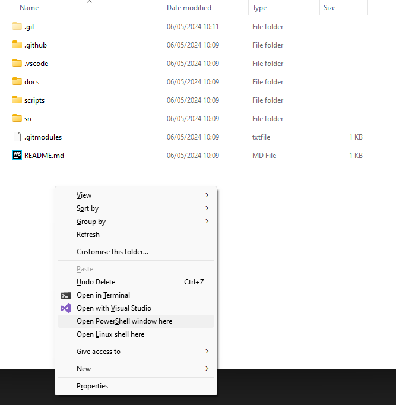
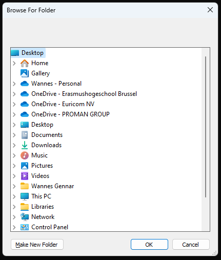

# Icarus save editor

A simple Icarus save file editor allowing you to quickly alter XP, credits, exotics and inventory durability.
now with dark mode support

## What if an item from a recent update isn't working?
The editor needs to be updated whenever the game files change.
You need to have a few things installed on your system to run the steps below:
- Git
- Flutter

To do this, clone this repository with Git using following command:
```shell
git clone https://github.com/dealloc/icarus_editor.git --recurse-submodules
```

Then open a powershell window in the root folder (the folder that just created after running `git clone`)
you can do this by holding shift and right clicking the empty space in the folder

and run the following command:
```powershell
.\scripts\Extract-Packs.ps1
```
This should open a popup asking to select a folder, here you need to select the root folder of your Icarus installation (under your steamapps etc):

Once you do the build runners should automatically generate the required code which you can submit in your fork.

## Screenshots


and dark mode


